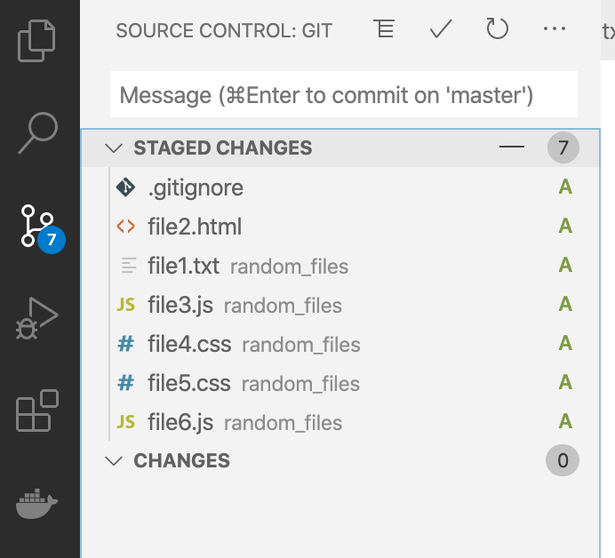

# Git - In home activity
1. Install git

   - [https://git-scm.com/downloads](https://git-scm.com/downloads)

     .png)

     .png>)

     .png>)

     .png>)

     .png>)

     .png>)

     .png>)
     
   - [Install git for Mac](https://www.atlassian.com/git/tutorials/install-git)

1) Configure git

   - Open **git bash** and type the following commands, but change the `user` and `email` with yours

     ```bash
     git config --global user.name "John Doe"
     ```

     ```bash
     git config --global user.email "john.doe@somemail.com
     ```


1. Initialize a Git repository to begin tracking new project – “homework-project”
   
2. Create 3 new files using the touch command (name them file1.txt, file2.html, and file3.js)
   
3. Create 1 new folder named random_files
   
4. Move the text file (.txt) and the js file (.js) into the random_files directory
   
5. Check the status of your repository (you will only see the random_files directory listed, not the files inside it)
   
6.  Add all newly created/untracked files and folders to the staging area
   
7.  Check the status of your repository
   
8.  Remove file3.js from the staging area
9. 
10. Create 3 new files in the random_files directory (name them file4.css, file5.css, and file6.js)
    
11. Check the status of your repository
    
12. Add all files with the file type of .css to the staging area (hint: you need to be inside of the random_files directory)
    
13. Check the status of your repository
    
14. Add all files with the file type of .js to the staging area
    
15. Check the status of your repository
    
16. Create a new directory named secret_stuff (hint: make sure you cd back into homework-project first)
    
17. Create two files inside of secret_stuff named file1.yml and file2.js
    
18. Create a .gitignore file so we can ignore the secret_stuff directory and all of its contents (hint: .gitignore should be inside of homework-project)
    
19. Add the secret_stuff folder to the .gitignore file
    
20. Check the status of your repository
    
21. Add the .gitignore file to the staging area
    
22. If your staging area looks like the image below then you have completed this exercise successfully. You may now commit your changes


