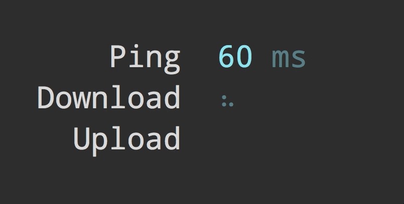

# npm - In home activity

1. Initialize `package.json` file and edit some of the properties if you want
   - Example: `author`, `license`, etc.

Don't forget to edit and specify the module type.

1. Install a few packages as dependencies

   - [is-number](https://www.npmjs.com/package/is-number) and import it

     ```js
     import isNumber from 'is-number';
     ```

   - [lodash](https://lodash.com/) - JavaScript utility library delivering modularity, performance & extras

     ```js
     import _ from 'lodash';
     ```

     - Check some of the functions of lodash ([join](https://lodash.com/docs/4.17.11#join), [pullAt](https://lodash.com/docs/4.17.11#pullAt))

1. Check if there is `@types` install for lodash to have autocomplete

   - Install [Types auto installer](https://marketplace.visualstudio.com/items?itemName=jvitor83.types-autoinstaller)
   - If not you could install it manually

     ```
     npm i @types/lodash
     ```

1. Iterate on the array `[1, 2, 'telerik aCademy', 'john', 'mAriA', 32, 'we ARE the CHAMPIONS']` and get only the values which are strings and create a new array with the capitalized strings

   - Example: `we ARE the CHAMPIONS` becomes `We are the champions`
   - Use `lodash` functions. Everything you need is there!

1. In order to start the program we must type `node main.js` (or the name of the file)

   - But lets create a script and put it in `package.json` file

1. Now we will use a global package
   - Global npm packages are not the best way to install dependencies, but sometimes are very useful.
   - They are accessible from anywhere on you computer, not only in the folder they are installed
   - They are installed with a **-g** / **--global** flag
1. Lets add a global package which is useful

   - It's called [speed-test](https://github.com/sindresorhus/speed-test) and it tests your internet connection

     ```
     npm i speed-test -g
     ```

   - Now lets start it. Since it is a global package you could open the console anywhere on your computer and you will have access to it

     ```
     speed-test
     ```

       
